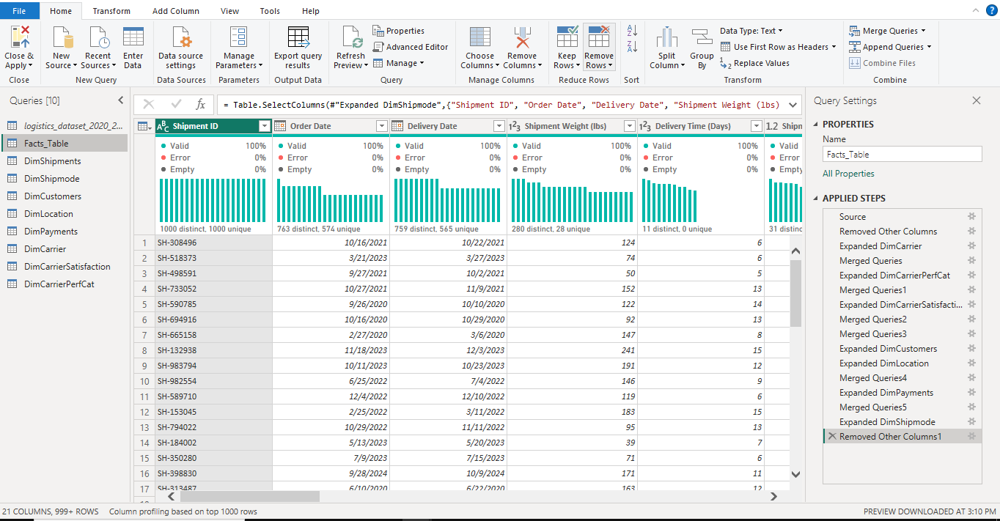
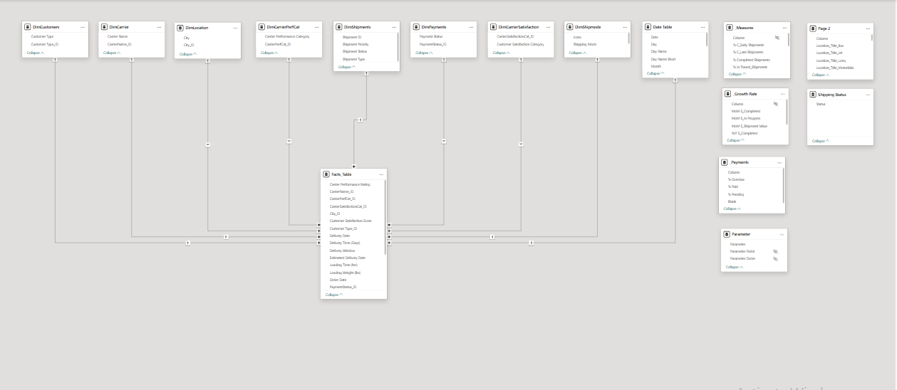

# Logistics-Analysis-Powerbi
---
This project analyzes logistics performance across different shipping modes (Jets, Bus, Lorry, and Motorbike), focusing on shipment completion rate, in-progress shipments, shipment value, and delivery time to uncover insights and improve operational efficiency.


## Table of Content 
- [Introduction](#Introduction)
- [Project Objectives](#Project-Objectives)
- [Data Cleaning and Transformation (Power Query)](#Data-Cleaning-Transformation-(Power-Query))
- [Data Normalization and Modelling](#Data-Normalization-and-Modelling)
- [Analysis and Calculations using Dax](#Analysis-and-Calculation-Using-DAX)
- [Data Visualization Dashboard Preview](#Data-Visualization-(Dashboard-Preview))
- [Insight](#Insight)
- [Conclusion](#Conclusion)
- [Recommendations](#Recommendations)
- [About Me](#About-Me)

---

## Introduction 

Logistics is the backbone of many businesses, yet delays, inefficiencies, and poor customer satisfaction can silently impact overall performance.

In this project, I analyzed a logistics dataset to evaluate shipment performance, delivery efficiency, and customer satisfaction across different shipping modes and cities.
The goal of this analysis is to provide insights into logistics operations, identify inefficiencies, and deliver actionable recommendations to optimize shipment completion rates and reduce in-progress shipments.
Additionally, this project examines shipment value, delivery timelines, and customer satisfaction levels to help stakeholders understand performance trends and assess the impact of different delivery modes on timely deliveries.


[Back to Top](#-table-of-contents)

---

## Project Objectives 

The objectives of this project are to;

- Measure completed shipments across various transport modes (Jets, Bus, Lorry, and Motorbike) and track their trends over time (monthly and yearly)
  
- Analyze shipment value, identifying patterns and fluctuations over time and across different transport modes.
  
- Break down shipment performance by region, with a focus on tracking expected shipments in each city by transport mode.

- Assess customer satisfaction based on shipment performance, delivery timelines, and feedback across different shipment types.

- Evaluate in-progress shipments to identify bottlenecks and areas for operational improvement.


[Back to Top](#-table-of-contents)

---

## Data Cleaning and Transformation (Power Query)

The dataset was cleaned and transformed using **Power Query** to ensure data consistency, accuracy, and readiness for analysis. Several transformation steps were applied to structure the data and create meaningful categories for better insights.



---
**1. Splitting Delivery Location**

- The **Delivery Location** column was splitted using a delimiter.
- This allowed extraction of structured fields such as **City** and **Region**.
- It improves location-based analysis and dashboard filtering.

**2. Customer Satisfaction
Categorization**

To make customer feedback more interpretable, the **Customer Satisfaction Score (CSS)** was grouped into a Likert-scale format.

A custom column named **Customer Satisfaction Category** was created using conditional logic.

**Categorization:**

- 1 – 2 → Very Dissatisfied  
- 3 – 4 → Dissatisfied  
- 5 – 6 → Neutral  
- 7 – 8 → Satisfied  
- 9 – 10 → Very Satisfied  

**Power Query Formula:**

```powerquery
if [CSS] >= 1 and [CSS] <= 2 then "Very Dissatisfied"
else if [CSS] >= 3 and [CSS] <= 4 then "Dissatisfied"
else if [CSS] >= 5 and [CSS] <= 6 then "Neutral"
else if [CSS] >= 7 and [CSS] <= 8 then "Satisfied"
else "Very Satisfied"
```
**3. Carrier Performance Rating Categorization**

To evaluate logistics efficiency, the **Carrier Performance Rating** was transformed into grouped categories.

A new column called **Carrier Performance Category** was also created using conditional logic.

**Categorization:**

- ≤ 2 → Low Rating  
- = 3 → Medium Rating  
- > 3 → High Rating  

**Power Query Formula:**

```powerquery
if [Carrier Performance Rating] <= 2 then "Low Rating"
else if [Carrier Performance Rating] = 3 then "Medium Rating"
else "High Rating"
```

[Back to Top](#-table-of-contents)

---

## Data Normalization and Modelling

To improve data structure, reduce redundancy, and enable efficient analysis, the dataset was normalized into multiple dimension tables and a central fact table using a **star ⭐ schema approach**.

**Data Normalization**

The raw dataset was decomposed into 8 smaller, well-structured tables to eliminate duplication and ensure consistency across the model and 1 Centralized facts table 

Each table was designed to represent a specific business entity.



**Dimension Tables**

The following dimension tables were created:

**📦 DimShipments**
Contains core shipment details:
- Shipment ID  
- Shipment Status  
- Shipment Type  
- Shipment Priority  

 **🚚 DimShippingMode**
Stores shipping method details:
- Shipping Mode (Bus, Jets, Lorry, Motorbike)

**👥 DimCustomer**
Contains customer segmentation:
- Customer Type (Business, Retail, International)  
- Customer ID (generated using index column)


**📍 DimLocation**
Stores geographical data:
- City  
- City ID  

**💳 DimPayment**
Captures payment information:
- Payment Status (Paid, Pending, Overdue)  
- Payment Status ID  

**🚛 DimCarrier**
Stores carrier details:
- Carrier Name  
- Carrier ID  

**⭐ DimCarrierSatisfaction**
Captures customer satisfaction categories:
- Customer Satisfaction Category  
- Satisfaction ID  

**📊 DimCarrierPerformance**
Captures carrier performance categories:
- Carrier Performance Category  
- Performance ID  

**Data Modelling**
After creating the dimension tables, relationships were established between them and the central fact table.

- A **star schema** was implemented  
- The **fact table** contains transactional shipment data  
- Dimension tables are linked using unique IDs (keys)  
- Relationships were created as **one-to-many (1:M)**  

This data model:

- Reduced data redundancy  
- Improved query performance  
- Enabled efficient filtering and slicing in Power BI  
- Provided a scalable structure for future data expansion


[Back to Top](#-table-of-contents)

---

## Analysis & Calculations (DAX)

To support the analysis, key DAX measures were created to track shipment performance, delivery efficiency, and financial metrics.

**Base Measures**

These foundational measures were created and reused across multiple calculations:

**📦 Total Shipments**
```DAX
Total Shipments = COUNTROWS('Fact Logistics')
```
**Shipment Status KPIs**
***Completed Shipment***
```DAX
Completed Shipments = 
CALCULATE(
    COUNTROWS('Fact Logistics'),
    'DimShipment'[Shipment Status] = "Completed"
)
```
**🚚 In-Progress Shipments**
***(All non-completed shipments grouped together)***
```DAX
In Progress Shipments = 
CALCULATE(
    COUNTROWS('Fact Logistics'),
    'DimShipment'[Shipment Status] IN {
        "In Transit",
        "Not Completed",
        "Ready for Pickup"
    }
)
```
**Shipment Value**
```DAX
Shipment Value = SUM('Fact Logistics'[Shipment Value ($)])
```
**Performance Ratios**
```DAX
% Completed = 
DIVIDE([Completed Shipments], [Total Shipments], 0)
```
***%Early Deliveries***
```DAX
% Early Shipments =
VAR Early =
    CALCULATE(
        COUNTROWS('Fact Logistics'),
        'DimShipment'[Shipment Status] = "Completed",
        'Fact Logistics'[Delivery Date] <= 'Fact Logistics'[Estimated Delivery Date]
    )
RETURN
DIVIDE(Early, [Completed Shipments], 0)
```
***%Late Deliveries***
```DAX
% Late Shipments =
VAR Late =
    CALCULATE(
        COUNTROWS('Fact Logistics'),
        'DimShipment'[Shipment Status] = "Completed",
        'Fact Logistics'[Delivery Date] > 'Fact Logistics'[Estimated Delivery Date]
    )
RETURN
DIVIDE(Late, [Completed Shipments], 0)
```
**Time-Based Analysis**
***Year-Over-Year(YoY)- Completed Shipments***
```DAX
YoY Completed Shipments =
VAR SPLY =
    CALCULATE(
        [Completed Shipments],
        SAMEPERIODLASTYEAR('DateTable'[Date])
    )
VAR YoY =
    DIVIDE([Completed Shipments], SPLY) - 1
RETURN
FORMAT(YoY, "0%")
```
***Month-over-Month - Shipment Value***
```DAX
MoM Shipment Value =
VAR PM =
    CALCULATE(
        [Shipment Value],
        PREVIOUSMONTH('DateTable'[Date])
    )
VAR MoM =
    DIVIDE([Shipment Value], PM) - 1
RETURN
FORMAT(MoM, "0%")
```
**Payments performance**
***% Paid Shipments***
```Dax
% Paid =
VAR Paid =
    CALCULATE(
        [Shipment Value],
        'DimPayment'[Payment Status] = "Paid"
    )
RETURN
DIVIDE(Paid, [Shipment Value], 0)
```

[Back to Top](#-table-of-contents)

---

## Data Visualization (Dashboard Preview)

This report is splitted into three (3) key sections :
- **Shipment Status Overview**
- **Shipment Performance by Shipping Mode**
- **Customer Experience Metrics**


[Back to Top](#-table-of-contents)

---

# Insight 
**Page 1: Shipment Status Overview**

This section highlights key performance metrics across shipment completion, operational efficiency, customer satisfaction, and shipment distribution.


**Completed Shipments**

- A total of **16.74K shipments were completed**, reflecting a **25% year-over-year (YoY) increase**.  
- The **total shipment value reached $11.32M**, indicating strong growth in logistics operations.  
- The **average delivery time is 10 days**, with minimal variation across transport modes.  

**Key Observation:**
- Consistent delivery time across modes suggests **standardized operations**, but may also indicate **limited optimization between transport options**.

**In-Progress Shipments**

- There are currently **47.46K shipments in progress**, significantly higher than completed shipments.  

**Key Concerns:**
- This large volume suggests a **potential operational backlog** or **capacity constraints**.  
- A high proportion of **priority shipments still pending** increases the risk of:
  - Delivery delays  
  - Customer dissatisfaction  
  - Service-level breaches  

**Customer Satisfaction**

- Customer satisfaction varies slightly across shipping modes:
  - **Motorbike** records the **highest satisfaction levels**  
  - **Lorry** records the **lowest satisfaction levels**  

**💡 Insight:**
- This indicates that **service quality differs by transport mode**, not just delivery speed.  
- Operational factors such as handling, flexibility, or last-mile delivery may influence satisfaction.

**Shipment Trends & Distribution**

- Shipment volume shows a **steady upward trend over time**, reflecting **business growth and increasing demand**.  
- **Standard shipments** account for the **largest share**, making them the dominant delivery type.

**💡 Insight:**
- The dominance of standard shipments suggests:
  - A strong base of regular demand  
  - Opportunities to optimize standard delivery processes for efficiency  

**Key Takeaway**

While the logistics operation is experiencing **significant growth in shipment volume and value**, the disproportionately high number of in-progress shipments signals a need for **capacity expansion and process optimization**.

Improving efficiency, especially for high-priority deliveries and lower-performing transport modes, will be critical to sustaining growth and maintaining customer satisfaction.

**Insights Page 2: Shipment Performance by Shipping Mode**

This section analyzes how different shipping modes perform across shipment volume, priority distribution, and regional activity.


**✈ Jet Shipments**

- A total of **4,250 shipments** were completed using **Jets**.  
- Shipment priorities are **evenly distributed** across High, Medium, and Low categories.  

 **Key 💡 Insight:**
- Jets are actively used in **high-demand cities like Lagos**, indicating their role in **time-sensitive and long-distance deliveries**.  
- Their balanced usage suggests flexibility across different shipment priorities.

 **🚚 Bus Shipments**

- **4,362 shipments** were completed via **Bus**, making it the **highest-performing transport mode by volume**.  
- **Medium-priority shipments dominate**, indicating strong usage for standard deliveries.  

**Key 💡 Insight:**
- Buses serve as the **core logistics channel**, handling the bulk of regular shipment operations.  
- Their dominance suggests they are likely the most **cost-effective and scalable option**.


**🚍 Lorry Shipments**

- **4,232 shipments** were completed using **Lorries**.  
- A significant portion of these are **high-priority shipments**.  

**Key💡 Insight:**
- Lorries appear to be used for **bulk and urgent deliveries**, possibly due to their capacity advantage.  
- This makes them critical for **heavy-load and high-value logistics operations**.


**🏍 Motorbike Shipments**

- **3,893 shipments** were completed via **Motorbike**, the lowest among all shipping modes.  
- Shipment priorities are **evenly distributed**.  

**Key💡 Insight:**
- Motorbikes are likely optimized for **last-mile delivery**, where speed and accessibility are crucial.  
- Despite lower volume, they play an important role in **customer experience and final delivery stages**.

**Regional Performance**

- Shipment distribution varies across cities such as **Lagos, Abuja, Kaduna, and Port Harcourt**.  
- **Lagos consistently records the highest shipment volume** across all shipping modes.  

**Key💡 Insight:**
- Lagos serves as the **primary logistics hub**, handling the largest share of operations.  
- Variations in regional performance highlight opportunities for:
  - Route optimization  
  - Better allocation of transport resources  
  - Expansion in underutilized regions  

**Key Takeaway**

Each shipping mode plays a distinct role within the logistics network:

- **Buses** → High-volume, cost-efficient operations  
- **Jets** → Fast, long-distance deliveries  
- **Lorries** → Bulk and high-priority shipments  
- **Motorbikes** → Last-mile delivery  

Optimizing how these modes are deployed across regions will be key to improving overall efficiency and scalability.

**Insights: Customer Experience & Delivery Metrics**

This section evaluates how customer type, delivery performance, shipment value, and operational factors influence overall customer satisfaction.


**Customer Type Insights**

- **Business customers** account for the largest share of shipments (**35.99%**), followed by:
  - **Retail** (**32.85%**)  
  - **International** (**31.16%**)  

**💡 Key Insight:**
- Business clients are the **primary drivers of logistics demand**, making them a critical segment for revenue and service optimization.  
- Maintaining high service quality for this segment is essential for long-term business growth.

**Delivery Performance & Customer Satisfaction**

- Most shipments receive **moderate to high ratings (3–5 stars)**.  
- A clear relationship exists between **delivery speed and customer satisfaction**:
  - Faster deliveries → Higher ratings  
  - Delayed deliveries → Lower ratings  

**Key Insight:**

- **Delivery time is a key determinant of customer satisfaction**, making operational efficiency a top priority.

**Shipment Value Impact**

- **Higher-value shipments** tend to receive more attention, often resulting in **better delivery outcomes and higher ratings**.  

**Key Observation:**
- Despite this trend, inconsistencies exist:
  - High-value shipments do not always guarantee high satisfaction  
- This indicates that **service quality and delivery timeliness outweigh shipment value alone**.

**Operational Observations**

- Shipment priority (**High, Medium, Low**) influences delivery handling:
  - **High-priority shipments** are generally processed faster  
- Performance varies across:
  - Cities  
  - Shipping modes  

**Key Concern:**
- These variations suggest **uneven service performance**, which may negatively impact customer experience in certain regions or delivery channels.

**Key Takeaway**

Customer satisfaction in logistics is primarily driven by **delivery efficiency and service consistency**, rather than shipment value alone.

To improve customer experience, the focus should be on:
- Reducing delivery delays  
- Ensuring consistent service across regions and shipping modes  
- Prioritizing key customer segments, especially business clients  

[Back to Top](#-table-of-contents)

---

## Conclusion

The analysis reveals that logistics operations are experiencing **steady growth**, as evidenced by the increase in completed shipments and overall shipment value.  

However, this growth is accompanied by a **significant rise in in-progress shipments**, indicating potential **operational bottlenecks and capacity constraints**.

**Across shipping modes:**
- **Buses** handle the highest shipment volume, making them the backbone of operations  
- **Motorbikes** deliver higher customer satisfaction, likely due to their efficiency in last-mile delivery  

Although **average delivery time remains consistent**, delays and shipment backlog continue to negatively impact customer experience.

Additionally, **Business customers contribute the largest share of shipments**, making them a critical segment for revenue and long-term growth.

Overall, while performance is improving, **inefficiencies in delivery execution and shipment handling** are limiting operational effectiveness and customer satisfaction


[Back to Top](#-table-of-contents)

---
## Recommendation

Based on the insights derived from the analysis, the following actions are recommended:

**1. Reduce Shipment Backlog**
- Increase operational capacity or optimize workflows  
- Streamline fulfillment processes to improve shipment completion rates  

**2. Leverage High-Performing Delivery Modes**
- Expand the use of **Motorbikes for last-mile delivery**  
- Focus on high-density areas (Lagos) where speed and flexibility are critical  

**3. Optimize Bus Operations**
- Improve efficiency in bus logistics, as they handle the **highest shipment volume**  
- Enhance scheduling, routing, and load management  

**4. Prioritize High-Value & High-Priority Shipments**
- Ensure faster processing for urgent and high-value deliveries  
- Implement stricter SLA tracking for priority shipments  

**5. Improve Delivery Time Consistency**
- Monitor delays across cities and shipping modes  
- Identify bottlenecks and standardize delivery processes  

**6. Focus on Key Customer Segments**
- Strengthen service delivery for **Business customers**, who represent the largest share of demand  
- Develop retention strategies to maintain long-term relationships  

By addressing operational inefficiencies and optimizing resource allocation, the logistics system can **scale effectively while maintaining high service quality and customer satisfaction**.


[Back to Top](#-table-of-contents)

---

## About Me

[Back to Top](#-table-of-contents)

---
